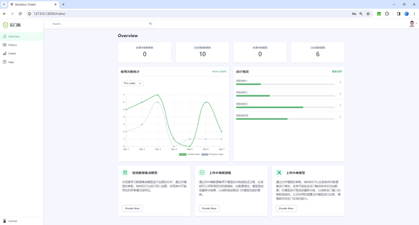
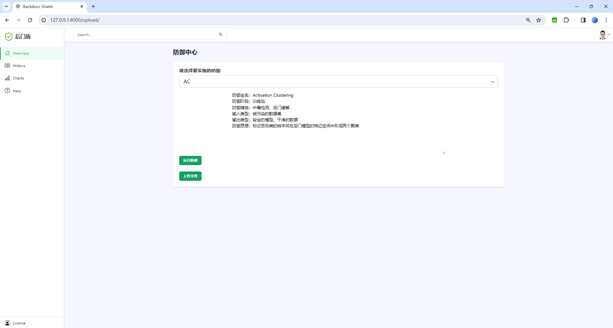
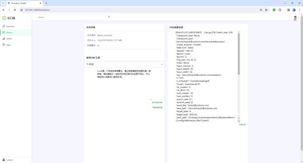
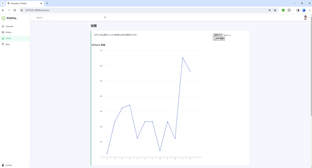
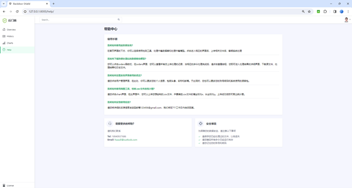

# Overview

8 attacks against 9 defense methods, with 5 poisoning ratios, based on 4 datasets and 5 models

我的torch配置：

```
# CUDA 11.3
pip install torch==1.11.0+cu113 torchvision==0.12.0+cu113 torchaudio==0.11.0 --extra-index-url https://download.pytorch.org/whl/cu113
```

# Detailed Data Structure

- attack : all attack should be put here separately
- defense : all defense should be put here separately 
- config : all config file in yaml (all attack and defense config should all be put here separately)
- data : data file
- models : models that do not in the torchvision
- record : all experiment generated files and logs (also important for load_result function)
- utils : frequent-use functions and other tools
  - aggregate_block : frequent-use blocks in script
  - bd_img_transform : basic perturbation on img
  - bd_label_transform : basic transform on label
  - dataset : script for loading the dataset
  - dataset_preprocess : script for preprocess transforms on dataset 
  - backdoor_generate_pindex.py : some function for generation of poison index 
  - bd_dataset.py : the wrapper of backdoored datasets 
  - trainer_cls.py : some basic functions for classification case
- resource : pre-trained model (eg. auto-encoder for attack), or other large file (other than data)

## Attack

Existing backdoor attack methods can be partitioned into two general categories, including data poisoning and training controllable.

|                  | File name                                             | Paper                                                                                                                                                                                                                                                                                                                                                         |
|------------------|-------------------------------------------------------|---------------------------------------------------------------------------------------------------------------------------------------------------------------------------------------------------------------------------------------------------------------------------------------------------------------------------------------------------------------|
| BadNets          | [badnets_attack.py](./attack/badnets_attack.py)       | [BadNets: Identifying Vulnerabilities in  the Machine Learning Model Supply Chain](https://www.google.com/url?sa=t&rct=j&q=&esrc=s&source=web&cd=&cad=rja&uact=8&ved=2ahUKEwir55bv0-X2AhVJIjQIHYTjAMgQFnoECCEQAQ&url=https%3A%2F%2Fmachine-learning-and-security.github.io%2Fpapers%2Fmlsec17_paper_51.pdf&usg=AOvVaw1Cu3kPaD0a4jgvwkPCX63j) IEEE Access 2019 |
| Blended          | [blended_attack.py](./attack/blended_attack.py)       | [Targeted Backdoor Attacks on Deep  Learning Systems Using Data Poisoning](https://arxiv.org/abs/1712.05526v1) Arxiv 2017                                                                                                                                                                                                                                     |
| Label Consistent | [lc_attack.py](./attack/lc_attack.py)                 | [Label-Consistent Backdoor Attacks](https://www.google.com/url?sa=t&rct=j&q=&esrc=s&source=web&cd=&cad=rja&uact=8&ved=2ahUKEwjvwKTx2bH4AhXCD0QIHVMWApkQFnoECAsQAQ&url=https%3A%2F%2Farxiv.org%2Fabs%2F1912.02771&usg=AOvVaw0NbPR9lguGTsEn3ZWtPBDR) Arxiv 2019                                                                                                 |
| SIG              | [sig_attack.py](./attack/sig_attack.py)               | [A new backdoor attack in  cnns by training set corruption](https://ieeexplore.ieee.org/document/8802997) ICIP 2019                                                                                                                                                                                                                                           |
| Low Frequency    | [lf_attack.py](./attack/lf_attack.py)                 | [Rethinking the Backdoor Attacks’ Triggers: A Frequency Perspective](https://openaccess.thecvf.com/content/ICCV2021/papers/Zeng_Rethinking_the_Backdoor_Attacks_Triggers_A_Frequency_Perspective_ICCV_2021_paper.pdf) ICCV2021                                                                                                                                |
| SSBA             | [ssba_attack.py](./attack/ssba_attack.py)             | [Invisible Backdoor Attack with  Sample-Specific Triggers](https://openaccess.thecvf.com/content/ICCV2021/papers/Li_Invisible_Backdoor_Attack_With_Sample-Specific_Triggers_ICCV_2021_paper.pdf) ICCV 2021                                                                                                                                                    |
| Input-aware      | [inputaware_attack.py](./attack/inputaware_attack.py) | [Input-Aware Dynamic Backdoor Attack](https://proceedings.neurips.cc/paper/2020/file/234e691320c0ad5b45ee3c96d0d7b8f8-Paper.pdf) NeurIPS 2020                                                                                                                                                                                                                 |
| WaNet            | [wanet_attack.py](./attack/wanet_attack.py)           | [WaNet -- Imperceptible  Warping-Based Backdoor Attack](https://openreview.net/pdf?id=eEn8KTtJOx) ICLR 2021                                                                                                                                                                                                                                                   |

For SSBA, the file we used with 1-bit embedded in the images is given at https://drive.google.com/drive/folders/1QU771F2_1mKgfNQZm3OMCyegu2ONJiU2?usp=sharing .

For lc attack the file we used is at https://drive.google.com/drive/folders/1Qhj5vXX7kX74IWdrQDwguWsV8UvJmzF4 .

For lf attack the file we used is at https://drive.google.com/drive/folders/16JrANmjDtvGc3lZ_Cv4lKEODFjRebmvk .


### Data poisoning attack

Attacker can only manipulate the training data. 

**Data poisoning** attack can be divided into two main categories based on the property of target labels. See the "Pre-knowledge" section below.

#### Inputs

A set of clean samples.

#### Functions

For data poisoning attack, it provides some functions, including **trigger generation**, **poisoned sample generation**(i.e., inserting the trigger into the clean sample), and **label changing**.

#### Outputs

 It outputs a poisoned dataset with **both poisoned and clean samples**.

#### Examples

- badnets_attack.py————BadNets
- blended_attack.py————Blended
- lc_attack.py————Label Consistent
- sig_attack.py————SIG 
- lf_attack.py————Low Frequency
- ssba_attack.py————SSBA

### Training controllable attack

Attacker can control both the training process and training data simultaneously. 

#### Inputs

A set of clean samples and a model architecture.

#### Outputs

A backdoored model and the learned trigger.

#### Examples

* inputaware_attack.py————Input-aware
* wanet_attack.py————WaNet


## Defense

According to the defense stage in the training procedure, existing defense methods can be partitioned into three categories, including pre-training, in-training and post-training. 

|       | File name                 | Paper                |
| :------------- |:-------------|:-----|
| FT| [ft.py](./defense/ft/ft.py) | standard fine-tuning|
| FP | [fp.py](./defense/fp/fp.py) | [Fine-Pruning: Defending Against Backdooring Attacks on Deep Neural Networks](https://link.springer.com/chapter/10.1007/978-3-030-00470-5_13) RAID 2018 |
| NAD      | [nad.py](./defense/nad/nad.py)                | [Neural Attention Distillation: Erasing Backdoor Triggers From Deep Neural Networks](https://openreview.net/pdf?id=9l0K4OM-oXE) ICLR 2021 |
| NC       | [nc.py](./defense/nc/nc.py)                   | [Neural Cleanse: Identifying And Mitigating Backdoor Attacks In Neural Networks](https://ieeexplore.ieee.org/stamp/stamp.jsp?arnumber=8835365), IEEE S&P 2019 |
| ANP      | [anp.py](./defense/anp/anp.py)                | [Adversarial Neuron Pruning Purifies Backdoored Deep Models](https://proceedings.neurips.cc/paper/2021/file/8cbe9ce23f42628c98f80fa0fac8b19a-Paper.pdf) NeurIPS 2021 |
| AC       | [ac.py](./defense/ac/ac.py)                   | [Detecting Backdoor Attacks on Deep Neural Networks by Activation Clustering](http://ceur-ws.org/Vol-2301/paper_18.pdf) ceur-ws 2018 |
| Spectral | [spectral.py](./defense/spectral/spectral.py) | [Spectral Signatures in Backdoor Attacks](https://proceedings.neurips.cc/paper/2018/file/280cf18baf4311c92aa5a042336587d3-Paper.pdf) NeurIPS 2018 |
| ABL      | [abl.py](./defense/abl/abl.py)                | [Anti-Backdoor Learning: Training Clean Models on Poisoned Data](https://proceedings.neurips.cc/paper/2021/file/7d38b1e9bd793d3f45e0e212a729a93c-Paper.pdf) NeurIPS 2021 |
| DBD | [dbd.py](./defense/dbd/dbd.py) | [Backdoor Defense Via Decoupling The Training Process](https://arxiv.org/pdf/2202.03423.pdf) ICLR 2022 |


### Defense Stage

#### Pre-training defense

Defender aims to remove or break the poisoned samples before training.

#### In-training defense

Defender aims to inhibit the backdoor injection during the training. 

- abl.py————ABL
- dbd.py————DBD

####  Post-training defense 

 Defender aims to remove or mitigate the backdoor effect from a backdoored model

- ft.py————FT
- fp.py————FP
- nad.py————NAD
- ac.py————AC
- nc.py————NC
- anp.py————ANP
- spectral.py————Spectral

### Defense Strategy


## Models

5 DNN models :

```python
models = ['preactresnet18', 'vgg19', "efficientnet_b3", "mobilenet_v3_large", "densenet161"]
```

## Databases

4 databases：

cifar10、cifar100、gtsrb、tiny

`mnist, cifar10, cifar100, gtsrb, celeba, tiny, imagenet`

(MNIST, CIFAR10, CIFAR100 using the pytorch official implementation, download when it is first executed. (TinyImageNet use third-party implementation, and it will be download when first executed.) The download script for GTSRB is in `./sh`. For CelebA and ImageNet, you need to download by yourself and change the dataset path argument. ) 

## Evaluation

在load_result.py里跑

- clean accuracy (C-Acc)————prediction accuracy of clean samples

- attack success rate(ASR)————prediction accuracy of poisoned samples to the target class
- robust accuracy(R-Acc)————prediction accuracy of poisoned samples to the original class

## Analysis

-  t-SNE
- Grad-CAM
- shapley value map
- neuron activation 
- frequency saliency

其中frequency saliency在visualize_fre.py里跑

其余的在Visualize.py里跑

## General Structure


# Project running screenshots (main page)

<div  align="center"> 

  









</div>

# How to use it in your web server?

* Apache : https://cn.linux-console.net/?p=14999
* Public IP address and domain name
* Django need to be installed
* If your server's operating system is Centos-7, you need to configure your yum correctly: https://zhuanlan.zhihu.com/p/719952763


